# **华东师范大学数据学院数据库管理实验报告**

| **课程名称**： 数据库管理 | **年级**：**2017**                   |
| ------------------------- | ------------------------------------ |
| **指导教师**：**周煊**    | **姓名**：**雷雅婧, 王原昭, 熊双宇** |

代码链接: https://gitee.com/earth_wyz/bookstore

## 一、业务需求分析

​	本课题旨在实现一个提供网上购书功能的网络后端，而其中最重要的相关对象即为买家和卖家。通过项目本身要求、对现实场景的分析及对已有电商平台的借鉴，我们认为买家和卖家各有如下需求（红色为附加完善功能），为之后完善的设计实现打下基础。

* 买家
  * 搜索图书
    * 搜索范围（按题目、作者、出版社、标签、内容关键字搜索）
    * 全站搜索/指定店铺搜索
    * <font color=red>按相关度排序</font>
  * 充值
  * 下单付款
  * 查看订单
    * <font color=red>按店铺查看</font>
    * <font color=red>按时间查看</font>
  * 修改订单：<font color=red>更改收货地址</font>
  * 取消订单
  * <font color=red>确认收货</font>
* 卖家
  * 创建店铺
  * 增加书籍信息及描述
  * 增加库存
  * <font color=red>发货</font>


## 二、设计思想

### 2.1 ER图设计

ER图设计如下

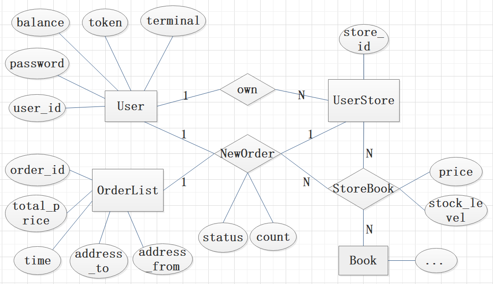

*   实体及其属性

    实体分别为：User（用户）、商店（UserStore）、订单（OrderList）、书本（Book），他们都使用自己的id作为主键，其余属性在上图中给出，值得注意的是我们在OrderList中增加了一个total_price属性，方便在后面功能实现中直接获取订单的总价，不必对订单中的每本书进行一遍计算。

*   关系及其属性

    User与UserStore之间有own关系，表示用户对商店的拥有关系，这是一个1-N关系，一个商店只能属于一个用户，一个用户可以有任意个商店。

    UserStore与Book之间有StoreBook关系，表示一个商店对书本的售卖关系，这是一个N-N关系，一个商店可以卖任意本书，一本书也可以被多个商店售卖。

    User、UserStore、OrderList、StoreBook之间有NewOrder关系，用来在订单产生的整个过程中将这些表联系起来，这个关系中有1个买家，1个商店、1个订单、多本书构成。值得注意的的是，在一般的ER图中，关系用来连接实体，但在这里我们为了简化设计，将NewOrder与StoreBook连接了起来，由于后续将ER图转化为为关系模式时实体和关系的地位是等价的，所以这样的连接是可以接受的。


### 2.2 关系模式设计

将ER图转化为关系模式，如下图所示，其中红色表示主键。

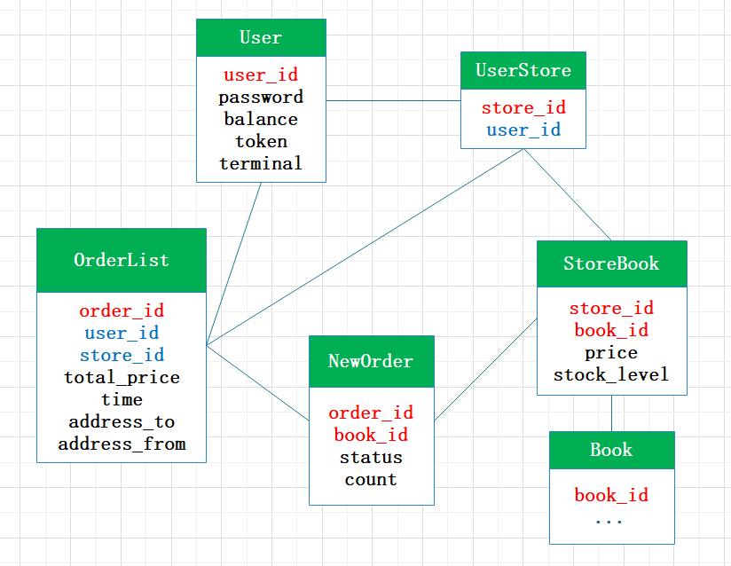

正如2-1节所示，由于own是1-N关系，所以在UserStore中加入user_id；由于NewOrder中一个关系只对应一个User和Store，所以将user_id和store_id放入OrderList中，剩下的NewOrder仅使用order_id和book_id作主键。

### 2.3 索引设计

由于主码是最常用的查询属性，主码上需要建立索引。其他的索引如下，具体的：

在OrderList表中，对user_id、store_id、time建立索引，以加快用户按商店，时间查询历史订单的速度。

在Book表中，对title建立索引，以加快用户按书名查询历史订单的速度；还对author、publisher、translator、pub_year等属性上建立了组合索引，在tags和content上建立了全文倒排索引，用来提升查询图书的速度。

### 2.3 规范化分析

在关系模式中，每个表中的非主属性均完全函数依赖于主码，因此符合BC范式。

## 三、功能实现

### 3.2 基本功能实现

#### 3.2.1 用户：注册、登录、登出、注销

##### 3.2.1.1 API

| Functions           | url               | input                                                        | methods | output                                                       |
| ------------------- | ----------------- | ------------------------------------------------------------ | ------- | ------------------------------------------------------------ |
| **register**        | URL + '/register' | json:{'user_id': string, 'password': string}                 | POST    | 1.successfully  register and login, a user  is inserted into ddatabase2.error because of existing user_id or invalid password(None); |
| **login**           | URL + '/login'    | json:{'user_id': string, 'password': string}                 | POST    | 1. successfully login: a token will be saved on database 2. error because of no existing user_id in database or password not match to the password in databse; |
| **logout**          | URL + '/logout'   | json:{'user_id': string}                                     | POST    | 1. successfully: the token of the user with user_id will be reset to None; 2. error because of no existing user_id in database; |
| **change password** | URL + '/password' | json:{'user_id': string, 'OldPassword': string,'NewPassword': string} | POST    | 1. successfully: the password of user with user_id will be changed to NewPassword ; 2. error because of no existing user_id in database, or the OldPassword doesn't match the password in database; |
| **unregister**      | URL + '/register' | json:{'user_id': string, 'password': string}                 | POST    | 1. successfully: the user with user_id will be deleted from database; 2. error because of no existing user_id in database, or the password doesn't match the password in database; |

##### 3.2.1.2 web

| Functions                | url               | methods |
| ------------------------ | ----------------- | ------- |
| **register_form**        | URL + '/register' | GET     |
| **login_form**           | URL + '/login'    | GET     |
| **logout_form**          | URL + '/logout'   | GET     |
| **change_password_form** | URL + '/password' | GET     |
| **unregister_form**      | URL + '/register' | GET     |

* 总功能测试(只包含成功的结果): Auto_web/总功能.mp4
* 单个测试(包含返回成功和错误的结果):

- - Register:  Auto_web/Register.mp4

  - Login:  Auto_web/Login.mp4
  - Change password:  Auto_web/Password.mp4
  - Unregister:  Auto_web/Unregister.mp4

##### 3.2.1.3 Workflow


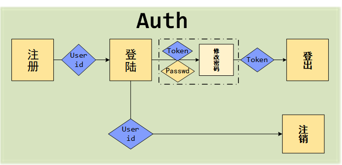

- 注意: 
  - user_id为user table主键, 不允许重复;
  - 为保证ACID:
    - 在注册/登陆/修改密码/注销中, 将检查user_id/password/token;
    - 在修改密码中, 将额外检查NewPassword是否Invalid(None);

#### 3.2.2 买家相关：充值、下单、付款

* 流程图

  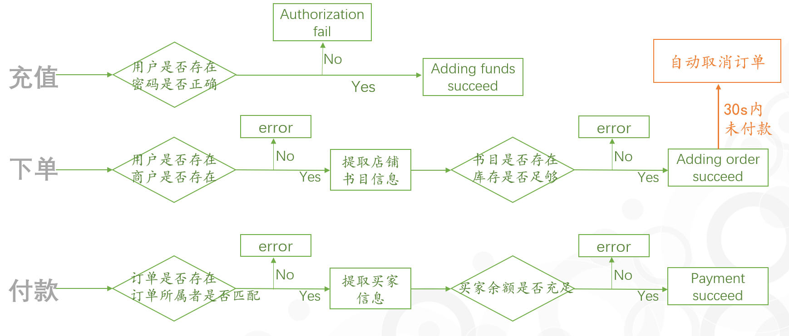

* 涉及API

  * sqlalchemy增删改查

  ```python
  session.query(<class>).filter(<条件>).all() #查询满足条件的所有记录
  old = session.query(<class>).filter(<条件>).first() #查询满足条件的一条记录
  session.add() #增加记录
  new = old.属性 + 1 #修改记录属性值
  session.delete() #删除记录
  ```

  * APScheduler任务调度框架

    买家进行下单操作后触发APScheduler trigger，设置经过30s后自动检查订单是否完成付款的作业（该作业在后台执行，不影响主线程运行）。若下单后30s经过检查发现订单未付款，则进行自动取消订单操作，恢复商店相应书目库存并删除订单记录（由于未付款订单多为买家所舍弃，后期不会进行查看，故使用`session.delete()`直接删除相关记录避免占用存储空间）

    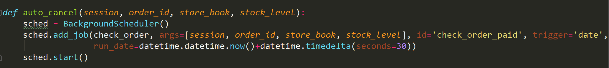


#### 3.2.3 卖家相关：建店、增书、库存

* 流程图

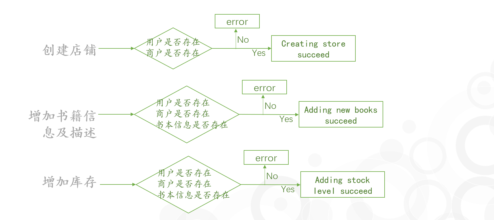

* 涉及API

  * sqlalchemy增删改查

  ```python
  session.query(<class>).filter(<条件>).all() #查询满足条件的所有记录
  old = session.query(<class>).filter(<条件>).first() #查询满足条件的一条记录
  session.add() #增加记录
  new = old.属性 + 1 #修改记录属性值
  session.delete() #删除记录
  ```


### 3.3 附加功能：发货、收货

```python
URL = 'http://127.0.0.1:5000/logistics'
```

**NewOrder's status:**

```python
Status = {
    'UNPAID': -1,
    'PAID': 0,
    'DELIVERING': 1,
    'ARRIVED': 2,
    'RECEIVED': 3,
    'CANCELED': 4,
}
```

#### 3.3.1 API

| Functions           | url                                            | input                                                        | methods | output                                                       |
| ------------------- | ---------------------------------------------- | ------------------------------------------------------------ | ------- | ------------------------------------------------------------ |
| **change_address**  | URL + '/address'                               | json:{'user_id': string, 'order_id': order_id, 'password': string,'NewAddress': str} | POST    | 1.successfully  change address 2.error because the status of order is after delivering; |
| **order_arrived**   | None(called by schedular in **start_deliver**) | 'order_id': str                                              | None    | 1.successfully  change the status of NewOrder from 'DELIVERING' to 'ARRIVED' 2.error because the status of order is 'CANCELED'; |
| **start_deliver**   | URL + '/deliver'                               | json:{'order_id': order_id}                                  | POST    | 1.successfully  change the status of NewOrder to 'DELIVERING' 2.error because the status of order is not 'PAID'; |
| **confirm_receipt** | URL + '/confirm'                               | json:{'user_id': string, 'order_id': order_id, 'password': string} | POST    | 1.successfully  change the status of NewOrder from 'ARRIVED' to  'RECEIVED' 2.error because the status of order is not 'ARRIVED'; |
| **auto_confirm**    | None(called by schedular in **order_arrived**  | 'order_id': str                                              | None    | 1.successfully  change the status of NewOrder from 'ARRIVED' to  'RECEIVED' 2.error because the status of order is not 'ARRIVED'; |
| **return_order**    | URL + '/return'                                | json:{'user_id': string, 'order_id': order_id, 'password': string} | POST    | 1.successfully  change the status of NewOrder from 'RECEIVED' to  'CANCELED', recover the related storage of seller and money of buyer 2.error because the status of order is not 'RECEIVED'; |
| **auto_cancel**     | defined in **buyer.py**                        |                                                              |         |                                                              |
| **cancel_order**    | defined in **order.py**                        |                                                              |         |                                                              |

#### 3.3.2 Workflow


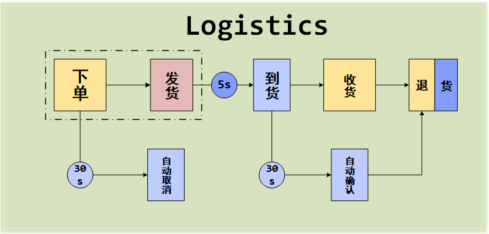


- 注意: 
  - 取消订单: 只能在发货前取消;
  
  - 退货: 只能在收货后退[退货涉及卖家和买家];
  
  - 由于没有'物流'的实体类, 在系统中设计订单发货后, 将在某段时间后到货, 这个时间间隔服从以5为均值, 1为标准差的正态分布, 单位为秒, 并且最大值小于5s;
  
  - 自动发货/自动确认: 通过开启新的线程, 运行于后台来实现:
  
    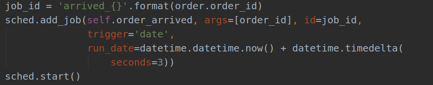
  
  - 为保证事务的ACID: 
    - 所有的操作视作事务来实现;
    - 在进行操作前, 将检查user_id/password/order_id/status等;

### 3.4 附加功能：订单相关

#### 3.4.1订单取消

*   流程图

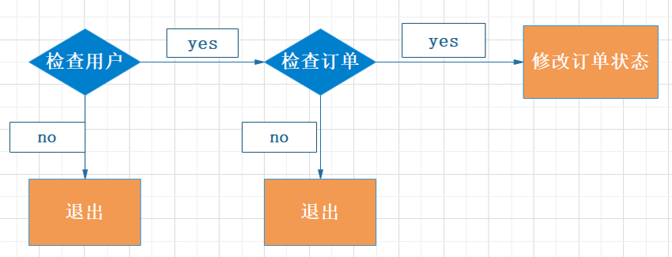


*   一致性

    以事务方式提交，在修改订单状态时，不允许别的任务修改订单的状态。


#### 3.4.2查询订单

##### 基本思想

基于 OrderList   $\bowtie$   NewOrder   $\bowtie$   StoreBook 

在sqlalchemy的API中可以以嵌套查询的方式进行，开销比join全部表更加小。可以查询某一用户的全部订单，也可以用一下3个条件进行限定：

*   指定商店名：在OrderList中先过滤出商店名字符合条件的记录，再嵌套查询剩下的表。
*   指定时间范围：在OrderList中先过滤出创建时间符合条件的记录，再嵌套查询剩下的表。
*   指定书名：当嵌套查询StoreBook时发现购买的所有书中都没有符合条件的书，就不把这个订单放到结果中。


##### 索引优化

在OrderList中对store_id和time建立索引，在StoreBook中对title建立索引。


##### 建表优化

在 NewOrder   $\bowtie$   StoreBook 这步操作中，我们的主要目的是为了根据NewStore的book_id从StoreBook中找到相应的title和price，于是我们可以将这两个属性添加到 NewOrder 中，以加快查询的速度，由于这两个属性长度较小，且基本不会被改动，因此冗余带来的提升远远超过不利因素。


### 3.5 附加功能：搜索图书

#### 3.4.1 设计思想

​	基于思考分析与设计，我们假定有一个书库保存所有图书的相关信息，且图书信息为客观存在不为卖家改动。同时，书库囊括了所有卖家所包含的书籍。由于书库中的信息涉及到大段文字和多图片，故选用了MongoDB来存储图书相关的信息。又为了避免分开存储信息而导致最终返回客户图书所有相关信息时多次访问数据库而造成不必要的延迟，因此我们将单本书的所有info存储在一个document中。

#### 3.4.2 MongoDB数据库设计

* collection层面

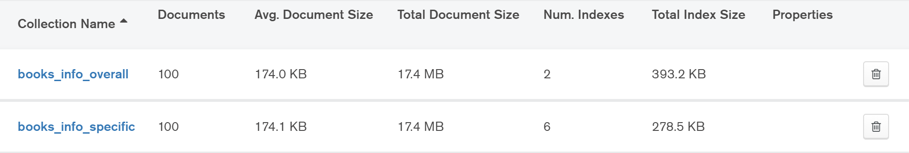

​		在名为bookstore的数据库中共设置了两个collection，其中存储的均为所有书目的相关信息，个别属性的存储方式不同（下文会详细解释）。不同collection分别用于全局搜索和范围搜索。如此设计的确在一定程度上造成了冗余的弊端，但这主要是由于MongoDB仅能设置一个全文索引的弊端且希望避免信息分开存储而导致返回给搜索者书目全部信息时的反复访问数据库造成开销和延迟。

* document层面

  * 全局搜索 books_info_overall

  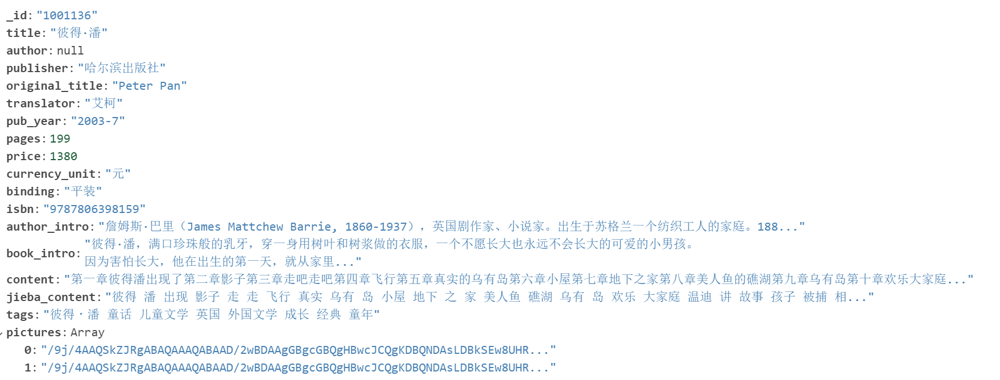

  ​	该document中存储的信息仅在全局搜索时被调用。上图为该collection中的一个document示例。从中可以看到，其信息基本按照原`.db`文件中的信息存储方式进行存储。不同的是此处的pictures属性以数组的方式进行存储，blob数据（如图片）较大，在MongoDB上存储在一定程度上能有效地减少较大数据的冗余。

  ​	此处需要强调的一点是，我们给其增加了一个“jieba_content”属性。原因是若直接建立全文索引，不同于英文单词以空格分隔，中文被自动分为词的部分将会为一个分句而并不具有搜索价值 。因此，我们对“content”属性进行了jieba分词并去除了设置的停用词表中的词语，留下有一定意义且有一定被搜索可能性的单词存储在“jieba_content”中，既避免了直接分词后不做处理的存储巨大损耗也完成了中文分词的目标。因此，对内容的相关搜索便可以关注"jieba_content"该属性。

  * 范围搜索 books_info_specific

  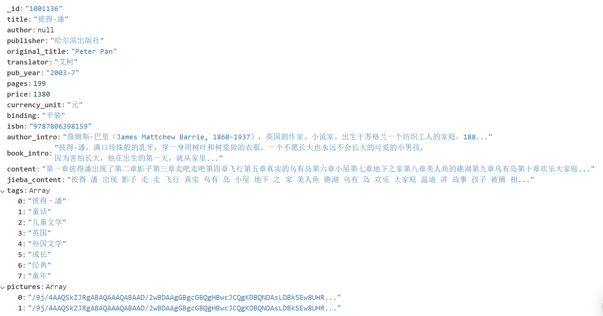

  ​	该document中存储的信息仅在范围搜索时被调用。上图为该collection中的一个document示例。该document与之前的全局搜索的相关collection并没有大的差异。不同之处在于，在此的tags设置为了数组。这是由于MongoDB不能建多个全文索引但可以对数组建多key索引，多key索引会为数组的每个元素建立一条索引。而全局搜索的collection中由于是对涉及所有相关范围的属性建全文索引，因此tags存为以空格分隔的string更合理。

* 索引设置

  * 全局搜索 books_info_overall

    * 全文索引：基于`title`, `author`, `publisher, tags`, `jieba_content`

      ​	全局搜索是不设置具体查询范围的全局的搜索筛选，因此对这些买家通常会感兴趣的属性建立全文索引可以优化全局搜索，返回给买家心仪的结果。

  * 范围搜索 books_info_specific

    * 单值索引：分别在`title`, `author`,` publisher`建立单值索引

      ​	由于买家进行搜索时大多会只围绕一个范围进行搜索，因此建立单值索引能很好地满足这种需求。同时，如果买家在多个范围提交多个关键词也能较好地完成搜索，因为MongoDB能“组合”相应的索引，完成快速查询。

    * 多key索引：`tags`

      ​	索引的字段为数组时创建。为数组中的每个元素都建立了一条索引。

    * 全文索引: `jieba_content`

      ​	由于`jieba_content`的分词较多，因此使用全文搜索能更好的优化性能。

#### 3.4.3 具体实现

* 通过url的POST获取用户设置的关键词

  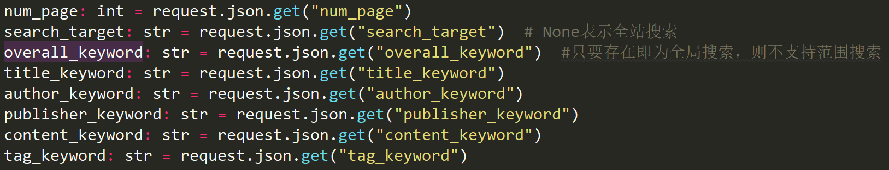

  ​	注：其中除了`num_page`与至少一个keyword相关不为空外，其余皆可为空。同时支持多个不同范围key_word查询，满足用户查询的各方面需求。search_target为None时则判断为全站搜索，否则为指定店铺搜索。若存在overall_keyword则表示为全局搜索，此时为全范围搜索，不支持指定范围搜索。

* 按相关度搜索排序

  ​	为了提高买家搜索图书的体验感，在此设计了按搜索匹配相关度进行排序。具体用到了MongoDB中全文索引`text`的`textscore`属性，该属性能体现document在某关键词上的匹配分数。最终，可利用`sort()`函数进行相关度的排序。

* 分页

  ​	MongoDB有**Limit**可以读取指定数量的数据记录，**Skip** 跳过指定数量的数据，它俩结合起来就可以做一个分页。提前设置好一页能显示的最大书籍信息数目`size`，通过POST获取买家浏览的页数`num_page`后即可根据`.limit(size).skip((num_page-1)*size)`获取对应的书籍信息。

* 全局搜索与按范围搜索

  * 全局搜索

  ```python
  books_info = list(books_storage_overall.find({'$text':{'$search':overall_keyword}},{"$score":{"$meta":"textScore"}}).limit(size).skip(offset).sort([('$score', {'$meta': 'textScore'})]))
  ```

  * 按范围搜索

  ```python
  books_info =list(books_storage.find(keywords).limit(size).skip(offset)).sort(keyword_list)
  ```

* 全站搜索与指定店铺搜索

  * 全站搜索：

    * 全局搜索

      ```PYTHON
      books_info = list(books_storage_overall.find({'$text':{'$search':overall_keyword}},{"$score":{"$meta":"textScore"}}).sort([('$score', {'$meta': 'textScore'})]).limit(size).skip(offset))
      ```

    * 按范围搜索(keywords存放从POST中获得的范围关键词)

      ```python
      books_info = list(books_storage.find(keywords).limit(size).skip(offset).sort(keyword_list))
      ```

  * 指定店铺搜索:

    ​	若要完成指定店铺搜索相关图书信息，则需要先从SQL中的`store_book`表中提取指定店铺所拥有的书目`book_id`信息。之后在书库中搜索满足条件的相关书目时，`book_id`得包含在提取出的集合中。

    * 全局搜索 (books存放指定店铺所拥有的全部书目id)

      ```python
      books_info = list(books_storage_overall.find({'_id':{"$in":books},'$text':{'$search':overall_keyword}},{"$score":{"$meta":"textScore"}}).limit(size).skip(offset).sort([('$score', {'$meta': 'textScore'})]))
      ```

    * 按范围搜索

      ```python
      books_info = list(books_storage.find({"$and":[{'_id':{"$in":books}},keywords]}).limit(size).skip(offset).sort(keyword_list))
      ```

      

## 四、性能测试

### 4.1 结果

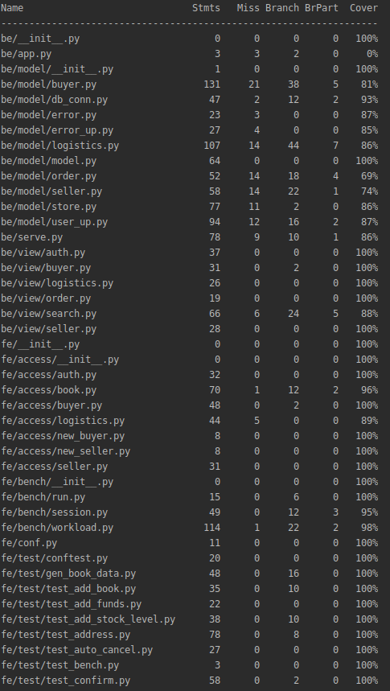

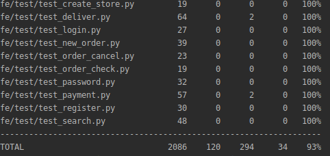

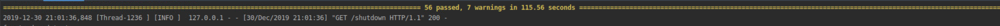

- 56 test functions

- All passed

- Cost about 2 minutes(测试自动取消订单和自动确认收货总计需要sleep约50s)
- Coverage: 93%

#### 4.2 分析

- conf

  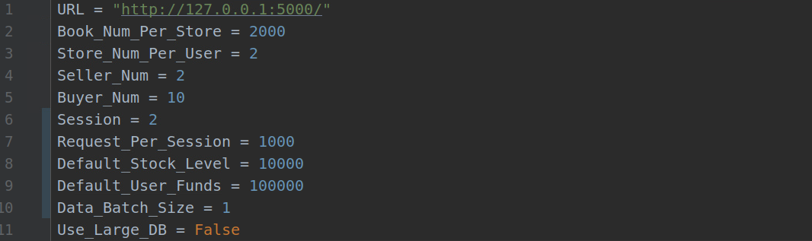

- log

  - 指标

    - |                                                              |
      | ------------------------------------------------------------ |
      | TPS_C(吞吐量):成功创建订单数量/(提交订单时间/提交订单并发数 + 提交付款订单时间/提交付款订单并发数) |
      | NO=OK:新创建订单数量                                         |
      | Thread_num:以新提交订单的数量作为并发数(这一次的TOTAL-上一次的TOTAL) |
      | TOTAL:总提交订单数量                                         |
      | LATENCY:提交订单时间/处理订单笔数(只考虑该线程延迟，未考虑并发) |
      | P=OK:新创建付款订单数量                                      |
      | Thread_num:以新提交付款订单的数量作为并发数(这一次的TOTAL-上一次的TOTAL) |
      | TOTAL:总付款提交订单数量                                     |
      | LATENCY:提交付款订单时间/处理付款订单笔数(只考虑该线程延迟，未考虑并发) |

  - 改进索引前:
    - 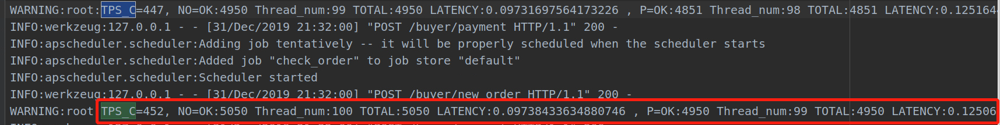
      - TPS_C: 452, LATENCY=0.097, LATENCY: 0.12506
  - 改进索引后:
    - 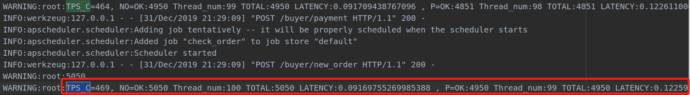
    - TPS_C: 469, LATENCY=0.092, LATENCY: 0.12259

## 五、版本控制

 Git version control

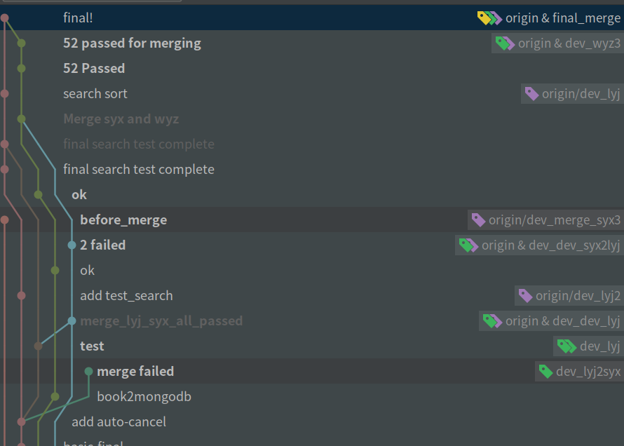


## 六 团队分工

* 全员：头脑风暴、思考设计、实验测试

* 王原昭：seller的基本功能, 订单的查询、取消          33.33333%贡献度

* 雷雅婧：buyer的基本功能，搜索图书          33.33333%贡献度

* 熊双宇：auth的基本功能（包括前端），收发货          33.33333%贡献度

  ​	【题外话】我们是一个非常团结nice的team，大家遇到问题都会互相探讨、解决，一起窝在实验头脑风暴的几天很累也有很多收获。每个人都付出了非常多，三个人缺一不可，非常感恩！

  